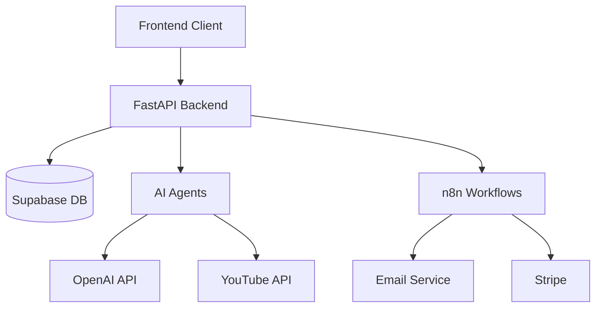

# Backend Architecture & API Design

## 1. System Architecture



## 2. API Specification

### Authentication Endpoints
```typescript
/**
 * Authentication Routes
 * Base Path: /api/auth
 */
interface AuthAPI {
  // Sign up new user
  "POST /signup": {
    body: {
      email: string;
      password: string;
      name?: string;
    };
    response: {
      user: User;
      token: string;
    };
  };

  // Sign in existing user
  "POST /signin": {
    body: {
      email: string;
      password: string;
    };
    response: {
      user: User;
      token: string;
    };
  };

  // Sign out user
  "POST /signout": {
    headers: {
      Authorization: `Bearer ${token}`;
    };
    response: {
      success: boolean;
    };
  };
}
```

### Course Generation Endpoints
```typescript
/**
 * Course Generation Routes
 * Base Path: /api/courses
 */
interface CourseAPI {
  // Generate course from YouTube URL
  "POST /generate": {
    body: {
      url: string;
      preferences?: {
        difficulty?: "beginner" | "intermediate" | "advanced";
        language?: string;
        duration?: number;
      };
    };
    response: {
      courseId: string;
      status: "processing" | "completed" | "failed";
      outline?: CourseOutline;
    };
  };

  // Get course generation status
  "GET /status/:courseId": {
    response: {
      status: "processing" | "completed" | "failed";
      progress: number;
      currentStep: string;
      eta?: number;
    };
  };

  // Update course outline
  "PUT /outline/:courseId": {
    body: {
      outline: Partial<CourseOutline>;
    };
    response: {
      course: Course;
      validationIssues?: ModificationImpact[];
    };
  };
}
```

### User Progress & Data Endpoints
```typescript
/**
 * User Data Routes
 * Base Path: /api/user
 */
interface UserAPI {
  // Get user progress
  "GET /progress": {
    response: {
      courses: {
        courseId: string;
        progress: number;
        lastAccessed: string;
        completed: boolean;
      }[];
    };
  };

  // Update course progress
  "POST /progress/:courseId": {
    body: {
      sectionId: string;
      completed: boolean;
      quizResults?: QuizResult;
    };
    response: {
      updatedProgress: number;
      nextSection?: string;
    };
  };
}
```

## 3. Supabase Database Schema

### Users Table
```sql
create table public.users (
  id uuid references auth.users not null primary key,
  email text not null unique,
  name text,
  created_at timestamp with time zone default now(),
  updated_at timestamp with time zone default now(),
  subscription_tier text default 'free',
  subscription_status text default 'active',
  subscription_ends_at timestamp with time zone
);
```

### Courses Table
```sql
create table public.courses (
  id uuid default uuid_generate_v4() primary key,
  title text not null,
  description text,
  difficulty text,
  created_by uuid references public.users,
  created_at timestamp with time zone default now(),
  updated_at timestamp with time zone default now(),
  status text default 'draft',
  youtube_url text,
  metadata jsonb default '{}'::jsonb,
  is_public boolean default false
);
```

### Course Content Table
```sql
create table public.course_content (
  id uuid default uuid_generate_v4() primary key,
  course_id uuid references public.courses not null,
  type text not null,
  title text not null,
  content jsonb not null,
  sequence integer not null,
  parent_id uuid references public.course_content,
  created_at timestamp with time zone default now(),
  updated_at timestamp with time zone default now()
);
```

### User Progress Table
```sql
create table public.user_progress (
  id uuid default uuid_generate_v4() primary key,
  user_id uuid references public.users not null,
  course_id uuid references public.courses not null,
  section_id uuid references public.course_content,
  status text default 'not_started',
  completed_at timestamp with time zone,
  last_accessed timestamp with time zone default now(),
  progress numeric default 0,
  metadata jsonb default '{}'::jsonb
);
```

## 4. AI Agent Integration

### Agent Architecture
```typescript
interface AIAgent {
  analyze(input: string): Promise<Analysis>;
  generate(context: Context): Promise<Generation>;
  validate(content: Content): Promise<ValidationResult>;
}

class CourseGenerationAgent implements AIAgent {
  private llm: OpenAIClient;
  private youtube: YouTubeClient;
  private storage: StorageService;

  async analyze(videoUrl: string): Promise<VideoAnalysis> {
    const transcript = await this.youtube.getTranscript(videoUrl);
    const analysis = await this.llm.analyze(transcript);
    return analysis;
  }

  async generate(context: CourseContext): Promise<CourseContent> {
    const outline = await this.generateOutline(context);
    const content = await this.generateContent(outline);
    const supplements = await this.generateSupplements(content);
    return { outline, content, supplements };
  }

  async validate(modifications: Modifications): Promise<ValidationResult> {
    const impacts = await this.assessImpacts(modifications);
    const suggestions = await this.generateSuggestions(impacts);
    return { impacts, suggestions };
  }
}
```

### OpenAI Integration
```typescript
class OpenAIClient {
  private api: OpenAI;
  private tokenizer: Tokenizer;

  async generateWithContext(
    prompt: string,
    context: string,
    options: GenerationOptions
  ): Promise<string> {
    const tokens = this.tokenizer.count(prompt + context);
    const model = this.selectModel(tokens, options);
    
    return this.api.complete({
      model,
      prompt: this.formatPrompt(prompt, context),
      maxTokens: options.maxTokens,
      temperature: options.temperature
    });
  }

  private selectModel(tokens: number, options: GenerationOptions): string {
    if (tokens > 4000) {
      return 'gpt-4-32k';
    }
    return options.priority === 'quality' ? 'gpt-4' : 'gpt-3.5-turbo';
  }
}
```

## 5. Cache & Optimization

### Response Caching
```typescript
interface CacheConfig {
  ttl: number;
  staleWhileRevalidate: boolean;
  tags: string[];
}

class ResponseCache {
  async get(key: string): Promise<CachedResponse | null> {
    const cached = await redis.get(key);
    if (!cached) return null;

    const data = JSON.parse(cached);
    if (this.isStale(data)) {
      this.revalidate(key, data);
    }
    return data;
  }

  async set(key: string, data: any, config: CacheConfig): Promise<void> {
    await redis.set(
      key,
      JSON.stringify({
        data,
        timestamp: Date.now(),
        ...config
      }),
      'EX',
      config.ttl
    );
  }
}
```

### Token Optimization
```typescript
class TokenOptimizer {
  optimizePrompt(prompt: string, context: string, maxTokens: number): string {
    const tokens = this.tokenizer.encode(prompt + context);
    if (tokens.length <= maxTokens) return prompt;

    return this.truncateContext(prompt, context, maxTokens);
  }

  private truncateContext(
    prompt: string,
    context: string,
    maxTokens: number
  ): string {
    const promptTokens = this.tokenizer.encode(prompt);
    const availableTokens = maxTokens - promptTokens.length;
    
    const contextTokens = this.tokenizer.encode(context);
    const truncatedTokens = contextTokens.slice(0, availableTokens);
    
    return this.tokenizer.decode(truncatedTokens);
  }
}
```

This architecture provides a scalable, efficient backend system optimized for course generation and user interaction.