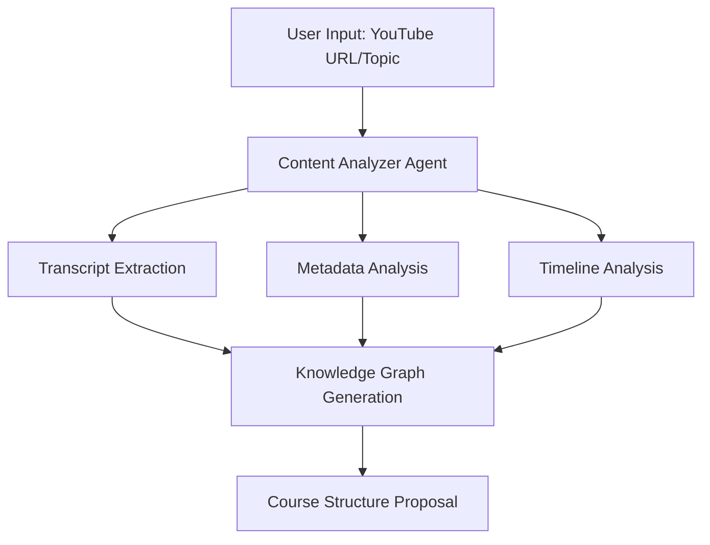

# Course Generation Process

## Overview

This document details the end-to-end process of course generation, from content analysis to user presentation.

## 1. Course Generation Workflow

### Initial Analysis Phase


### Content Structuring
```typescript
interface CourseOutline {
  title: string;
  description: string;
  prerequisites: Prerequisite[];
  learningOutcomes: LearningOutcome[];
  modules: Module[];
  metadata: CourseMetadata;
}

interface Module {
  title: string;
  description: string;
  sections: Section[];
  estimatedDuration: number;
  difficulty: 'beginner' | 'intermediate' | 'advanced';
}

interface Section {
  title: string;
  videoId: string;
  startTime: number;
  endTime: number;
  summary: string;
  keyPoints: string[];
  supplementaryContent: SupplementaryContent;
}
```

### Prerequisites & Learning Outcomes Analysis
```typescript
interface PrerequisiteAnalysis {
  requiredSkills: {
    skill: string;
    level: 'basic' | 'intermediate' | 'advanced';
    description: string;
  }[];
  tools: {
    name: string;
    version: string;
    purpose: string;
  }[];
  priorKnowledge: string[];
}

interface LearningOutcome {
  category: 'knowledge' | 'skill' | 'competency';
  description: string;
  assessmentCriteria: string[];
  difficulty: number;
}
```

## 2. Content Processing Pipeline

### Video Analysis
```typescript
class VideoAnalyzer {
  async analyzeContent(videoUrl: string): Promise<VideoAnalysis> {
    const transcript = await this.extractTranscript(videoUrl);
    const segments = await this.segmentContent(transcript);
    const topics = await this.identifyTopics(segments);
    const prerequisites = await this.identifyPrerequisites(transcript);
    const outcomes = await this.generateLearningOutcomes(topics);
    
    return {
      segments,
      topics,
      prerequisites,
      outcomes,
      metadata: await this.extractMetadata(videoUrl)
    };
  }
}
```

### Content Segmentation
```typescript
interface ContentSegment {
  timestamp: number;
  duration: number;
  transcript: string;
  topics: string[];
  concepts: string[];
  difficulty: number;
  type: 'theory' | 'demonstration' | 'example' | 'exercise';
}

class ContentSegmenter {
  async segmentVideo(transcript: string): Promise<ContentSegment[]> {
    // Natural language processing to identify logical breaks
    // Topic modeling to group related content
    // Difficulty estimation based on concept complexity
    return segments;
  }
}
```

## 3. User Interface for Course Review

### Course Preview Dialog
```tsx
interface CoursePreviewProps {
  outline: CourseOutline;
  onModify: (modifications: OutlineModification) => void;
  onApprove: () => void;
}

export function CoursePreviewDialog({
  outline,
  onModify,
  onApprove
}: CoursePreviewProps) {
  return (
    <Dialog>
      <DialogContent className="max-w-4xl">
        <DialogHeader>
          <DialogTitle>Review Course Outline</DialogTitle>
          <DialogDescription>
            Review and modify the generated course structure
          </DialogDescription>
        </DialogHeader>

        <Tabs defaultValue="overview">
          <TabsList>
            <TabsTrigger value="overview">Overview</TabsTrigger>
            <TabsTrigger value="prerequisites">Prerequisites</TabsTrigger>
            <TabsTrigger value="outcomes">Learning Outcomes</TabsTrigger>
            <TabsTrigger value="modules">Modules</TabsTrigger>
          </TabsList>

          <TabsContent value="overview">
            <CourseOverview outline={outline} />
          </TabsContent>
          
          <TabsContent value="prerequisites">
            <PrerequisiteEditor
              prerequisites={outline.prerequisites}
              onModify={handlePrerequisiteModification}
            />
          </TabsContent>
          
          {/* Other tab contents */}
        </Tabs>

        <ModificationWarnings
          modifications={modifications}
          onRevert={handleRevert}
          onFix={handleAutomaticFix}
        />

        <DialogFooter>
          <Button variant="outline" onClick={handleRegenerate}>
            Regenerate
          </Button>
          <Button onClick={handleApprove}>
            Create Course
          </Button>
        </DialogFooter>
      </DialogContent>
    </Dialog>
  )
}
```

### Modification Handling
```typescript
interface ModificationImpact {
  type: 'gap' | 'misrepresentation' | 'sequence';
  severity: 'low' | 'medium' | 'high';
  description: string;
  suggestedFix: string;
  affectedSections: string[];
}

class ModificationAnalyzer {
  async analyzeModification(
    original: CourseOutline,
    modified: CourseOutline
  ): Promise<ModificationImpact[]> {
    const impacts = [];
    
    // Analyze for content gaps
    const gaps = this.findContentGaps(original, modified);
    
    // Check for misrepresentation
    const misrepresentations = this.checkContentAccuracy(modified);
    
    // Verify learning sequence
    const sequenceIssues = this.validateLearningSequence(modified);
    
    return [...gaps, ...misrepresentations, ...sequenceIssues];
  }

  async suggestFixes(impacts: ModificationImpact[]): Promise<ModificationFix[]> {
    return impacts.map(impact => ({
      impact,
      fixes: this.generateFixOptions(impact)
    }));
  }
}
```

## 4. Supplementary Content Generation

### Content Types
```typescript
interface SupplementaryContent {
  explanations: TextualExplanation[];
  examples: CodeExample[];
  visualAids: VisualAid[];
  exercises: PracticeExercise[];
}

interface TextualExplanation {
  concept: string;
  explanation: string;
  level: 'basic' | 'detailed' | 'advanced';
  references: Reference[];
}

interface CodeExample {
  language: string;
  code: string;
  explanation: string;
  runnable: boolean;
  testCases?: TestCase[];
}

interface VisualAid {
  type: 'diagram' | 'screenshot' | 'flowchart';
  source: string;
  caption: string;
  altText: string;
}
```

### Generation Strategy
```typescript
class SupplementaryContentGenerator {
  async generateContent(
    segment: ContentSegment,
    context: CourseContext
  ): Promise<SupplementaryContent> {
    // Generate explanations
    const explanations = await this.generateExplanations(segment);
    
    // Create code examples
    const examples = await this.createCodeExamples(segment);
    
    // Generate visual aids
    const visuals = await this.generateVisualAids(segment);
    
    // Create practice exercises
    const exercises = await this.createExercises(segment);
    
    return {
      explanations,
      examples,
      visuals,
      exercises
    };
  }

  private async generateExplanations(
    segment: ContentSegment
  ): Promise<TextualExplanation[]> {
    // Use LLM to generate detailed explanations
    // Include analogies and real-world applications
    // Add references and further reading
    return explanations;
  }

  private async createCodeExamples(
    segment: ContentSegment
  ): Promise<CodeExample[]> {
    // Generate practical code examples
    // Include comments and explanations
    // Create runnable examples where applicable
    return examples;
  }
}
```

This implementation provides a robust foundation for generating comprehensive courses while maintaining quality and educational effectiveness.