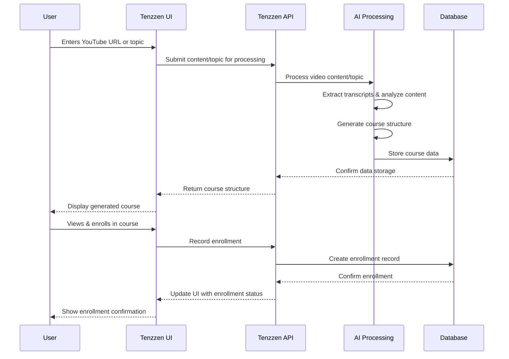
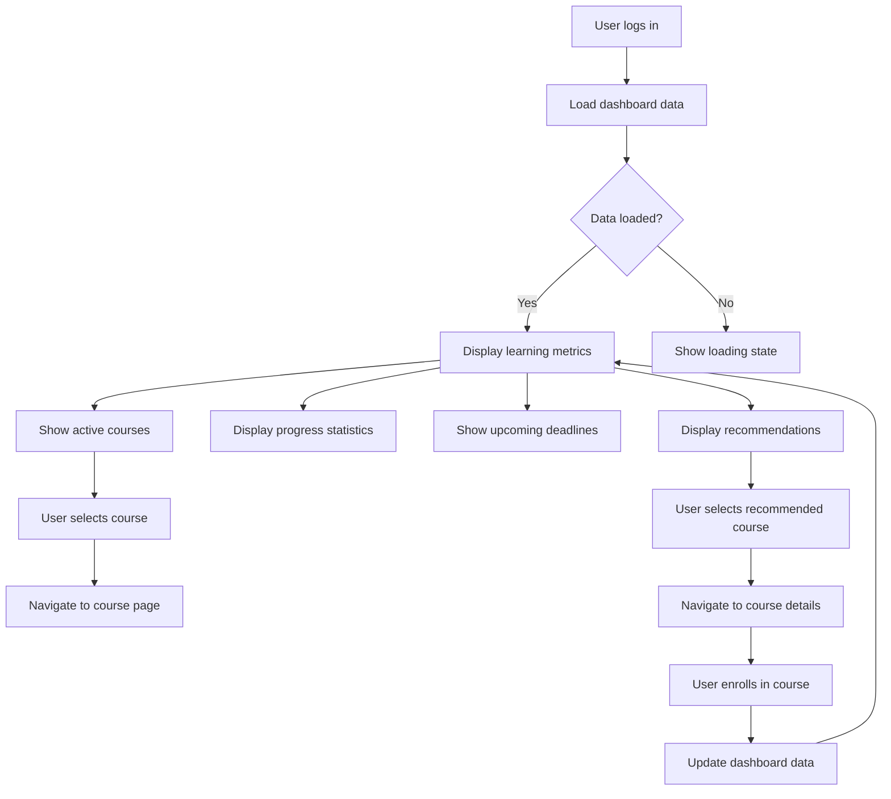
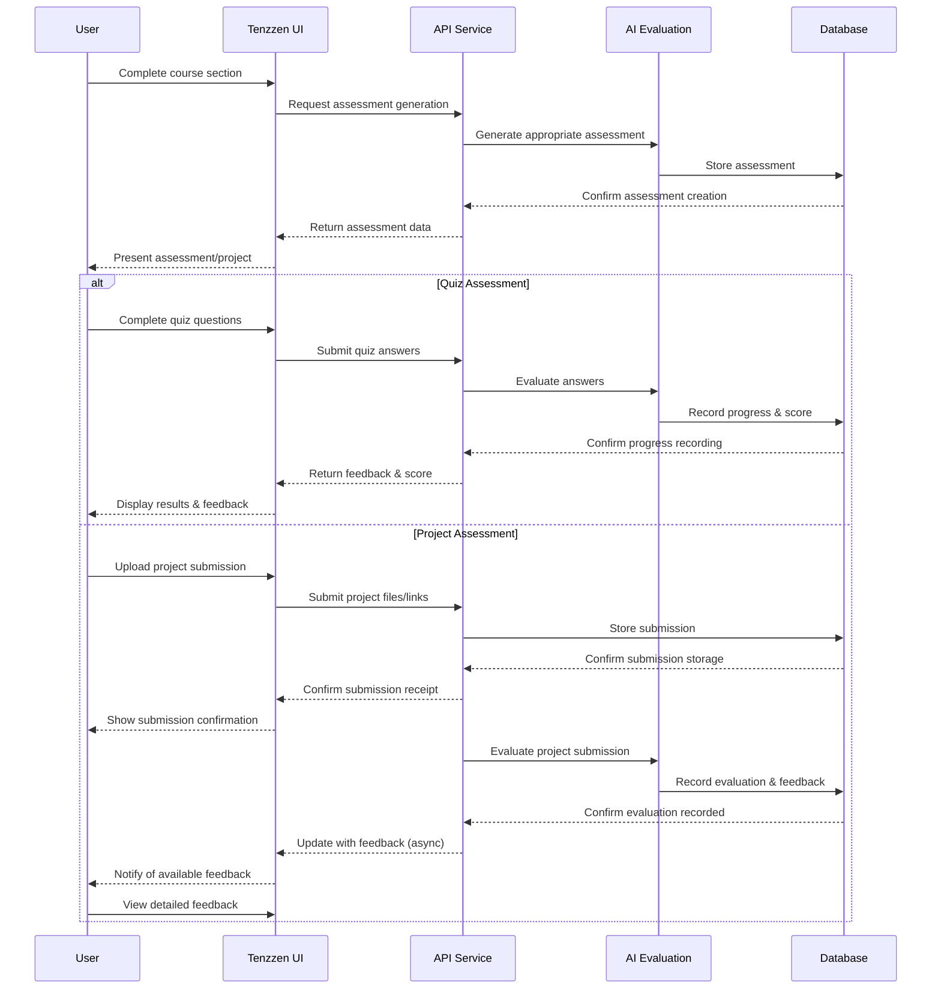
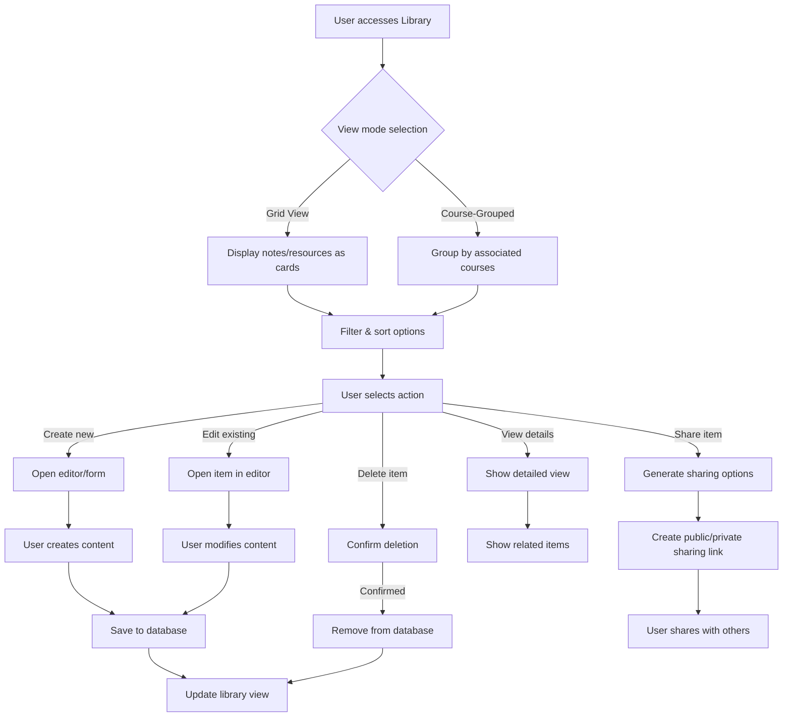
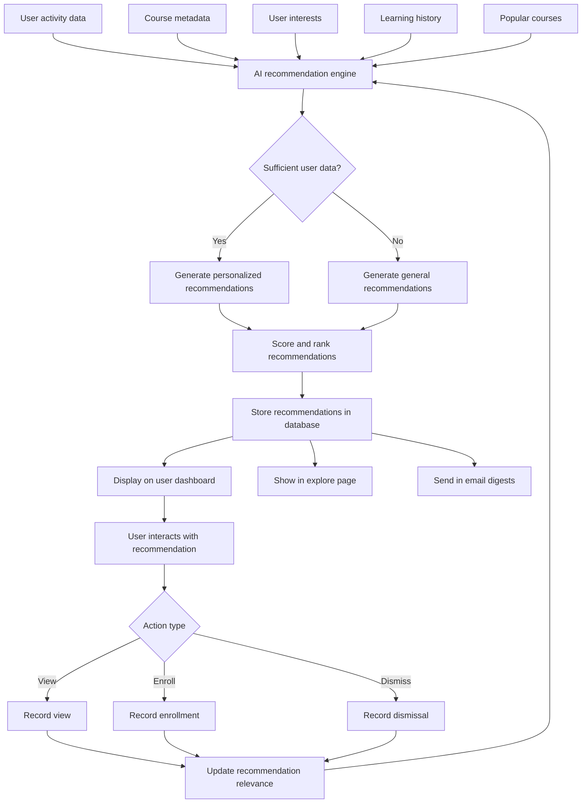
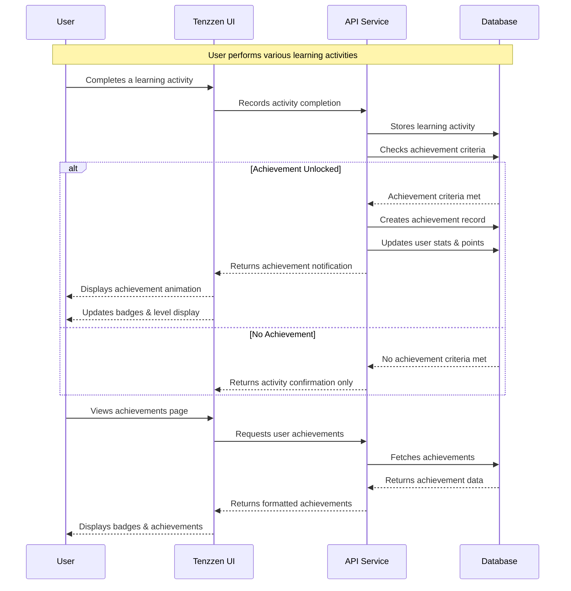

# Tenzzen Database Structure and User Flows

This document provides a comprehensive overview of the database architecture and user interaction flows for the Tenzzen learning platform.

## Database Schema Diagram

```mermaid
erDiagram
    videos ||--o{ playlist_videos : contains
    playlists ||--o{ playlist_videos : has
    courses ||--o{ enrollments : enrolled_in
    courses ||--o{ course_categories : categorized_as
    categories ||--o{ course_categories : includes
    courses ||--o{ assessments : contains
    assessments ||--o{ progress : tracked_in
    users ||--o{ user_profiles : has_profile
    users ||--o{ enrollments : enrolls_in
    users ||--o{ progress : completes
    users ||--o{ notes : creates
    users ||--o{ resources : manages
    users ||--o{ user_stats : has
    users ||--o{ project_submissions : submits
    courses ||--o{ project_submissions : includes
    users ||--o{ learning_activities : generates
    users ||--o{ user_interests : has
    users ||--o{ recommendations : receives
    users ||--o{ achievements : earns
    courses ||--o{ ratings : receives
    courses ||--o{ course_tags : tagged_with
    tags ||--o{ course_tags : used_in
    course_groups ||--o{ course_group_members : contains
    courses ||--o{ course_group_members : belongs_to

    videos {
        string youtubeId
        object details
        array transcripts
        string cachedAt
    }

    playlists {
        string youtubeId
        string title
        string description
        string thumbnail
        number itemCount
        string cachedAt
    }

    playlist_videos {
        id playlistId
        id videoId
        number position
    }

    categories {
        string name
        string description
        string icon
        string color
        string slug
        number courseCount
    }

    tags {
        string name
        number useCount
    }

    course_tags {
        id courseId
        id tagId
    }

    courses {
        string title
        string subtitle
        string description
        string videoId
        string thumbnail
        boolean isPublic
        string creatorId
        number avgRating
        number enrollmentCount
        object overview
        array sections
        object metadata
        string status
        number createdAt
        number updatedAt
        number estimatedHours
        array tags
        boolean featured
        number popularity
    }

    course_categories {
        id courseId
        id categoryId
    }

    enrollments {
        string userId
        id courseId
        number enrolledAt
        number lastAccessedAt
        string completionStatus
        number progress
        boolean isActive
        array completedLessons
        string lastLessonId
        number totalTimeSpent
        string notes
        boolean reminderEnabled
        string reminderFrequency
        object learningGoal
    }

    ratings {
        string userId
        id courseId
        number rating
        string review
        number createdAt
        number updatedAt
        number helpful
        boolean reported
        boolean verified
    }

    assessments {
        string title
        string description
        id courseId
        string type
        array questions
        string instructions
        array projectRequirements
        string submissionType
        array resources
        number deadline
        number createdAt
        string difficulty
        number estimatedTime
        number passingScore
        boolean allowRetries
        number maxRetries
    }

    progress {
        string userId
        id assessmentId
        string status
        number score
        any feedback
        any submission
        number startedAt
        number completedAt
        number attemptNumber
        number timeSpent
    }

    project_submissions {
        string userId
        id assessmentId
        string submissionUrl
        array fileIds
        string notes
        string status
        string feedback
        number grade
        number submittedAt
        number reviewedAt
        string reviewerNotes
        number revisionCount
    }

    notes {
        string userId
        string title
        string content
        id courseId
        string lessonId
        array tags
        number createdAt
        number updatedAt
        boolean isPublic
        string aiSummary
        array highlights
        boolean isFavorite
    }

    resources {
        string userId
        string title
        string type
        string url
        string content
        id courseId
        string lessonId
        string description
        array tags
        number createdAt
        number updatedAt
        boolean isPublic
        number views
        boolean isFavorite
        string sourceType
    }

    user_profiles {
        string userId
        string bio
        string timezone
        string language
        object preferences
        object learningPreferences
        number updatedAt
    }

    user_stats {
        string userId
        number totalLearningHours
        number coursesCompleted
        number coursesInProgress
        number assessmentsCompleted
        number projectsSubmitted
        number lastActiveAt
        number streakDays
        number longestStreak
        number totalPoints
        array weeklyActivity
        array badges
        number level
        string learningStyle
        array topCategories
    }

    learning_activities {
        string userId
        string type
        id courseId
        string lessonId
        id assessmentId
        number timestamp
        any metadata
        boolean visible
    }

    user_interests {
        string userId
        id categoryId
        number interestLevel
        number createdAt
        number updatedAt
        string source
    }

    recommendations {
        string userId
        id courseId
        number score
        string reason
        number createdAt
        boolean viewed
        boolean dismissed
    }

    achievements {
        string userId
        string type
        string title
        string description
        number awardedAt
        number points
        string icon
        number level
        any metadata
    }

    course_groups {
        string title
        string description
        string thumbnail
        string creatorId
        boolean isPublic
        number createdAt
        number updatedAt
        number courseCount
        array tags
        string slug
    }

    course_group_members {
        id groupId
        id courseId
        number position
    }

    users {
        string clerkId
        string name
        string email
        string imageUrl
        string authProvider
        string role
        string status
        number createdAt
        number updatedAt
        object lastLogin
    }
```

## Core Entity Relationships

### Content Organization

- **Videos** are the fundamental content units that can be organized into **Playlists**.
- **Courses** are structured learning experiences built from video content with additional structure (sections, lessons).
- **Categories** and **Tags** provide classification and searchability for courses.
- **Course Groups** allow for organizing related courses (e.g., learning paths, specializations).

### User Management

- **Users** contain core identity information linked with Clerk authentication.
- **User Profiles** store extended user information and preferences.
- **User Stats** track overall learning metrics for dashboards.

### User Learning Journey

- **Enrollments** track a user's progress through a course.
- **Progress** records assessment completion and scores.
- **Project Submissions** store user-submitted projects for review.
- **Notes** and **Resources** enable users to create and organize personal study materials.

### User Experience & Engagement

- **Learning Activities** record detailed user interactions for the activity feed.
- **User Interests** and **Recommendations** power the personalized course suggestions.
- **Achievements** support gamification elements like badges and points.
- **Ratings** allow users to review and rate courses.

## User Flow Diagrams

### 1. Course Generation Flow

### 2. Learning Dashboard Flow

### 3. Assessment & Project Submission Flow

### 4. Note-Taking & Resource Management Flow

### 5. Recommendation Engine Flow

### 6. Achievement & Gamification Flow

## Implementation Notes

### Data Consistency Strategy

- **Enrollment Progress Calculation**: Real-time updates based on completed lessons vs. total lessons.
- **User Stats Aggregation**: Background job updates stats based on activity history.
- **Course Rating Calculation**: Weighted average of all ratings, updated on new reviews.

### Performance Considerations

- Indexes on frequently queried fields (userId, courseId, completion status).
- Denormalization of certain data (e.g., course tags as array) for read performance.
- Activity logs partitioned by time periods to improve query performance.
- Search indexes to enable efficient content discovery and filtering.

### Security & Privacy

- User-specific data isolated through userId partitioning.
- Content visibility controlled through isPublic flags.
- User-generated content filterable by public/private status.
- Role-based access controls implemented through user roles.

## Type System

The database implements a strong type system for consistent data handling:

- **CourseStatus**: "draft" | "published" | "archived"
- **CompletionStatus**: "not_started" | "in_progress" | "completed"
- **AssessmentType**: "quiz" | "project" | "assignment"
- **SubmissionStatus**: "submitted" | "reviewed" | "revisions_requested" | "approved"
- **ActivityType**: Various activity types like "started_course", "completed_lesson", etc.
- **ResourceType**: "link", "document", "file", "video", "image", "code", "pdf"
- **DifficultyLevel**: "beginner", "intermediate", "advanced", "expert"

## Migration Path

For planned transitions:

1. **Legacy to Enhanced Schema**:

   - ✅ Transcripts migrated from standalone table to nested structure in videos.
   - ✅ Course tags moved from simple arrays to relational course_tags table.

2. **Feature Expansion**:
   - ✅ Project-based learning now leverages the assessments and project_submissions tables.
   - ✅ Gamification implemented using achievements and user_stats tables.
   - ✅ Personalization engine now uses learning_activities and user_interests.
   - 🔄 Enhanced community features planned using public courses and shared resources.

This database structure supports all current Tenzzen features while enabling future expansion into advanced learning analytics, social learning features, and content marketplace capabilities.
