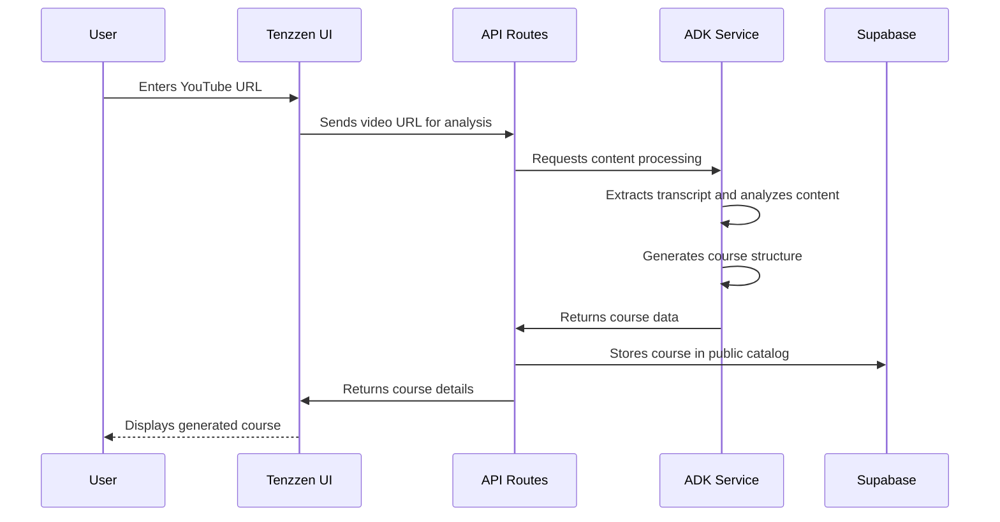
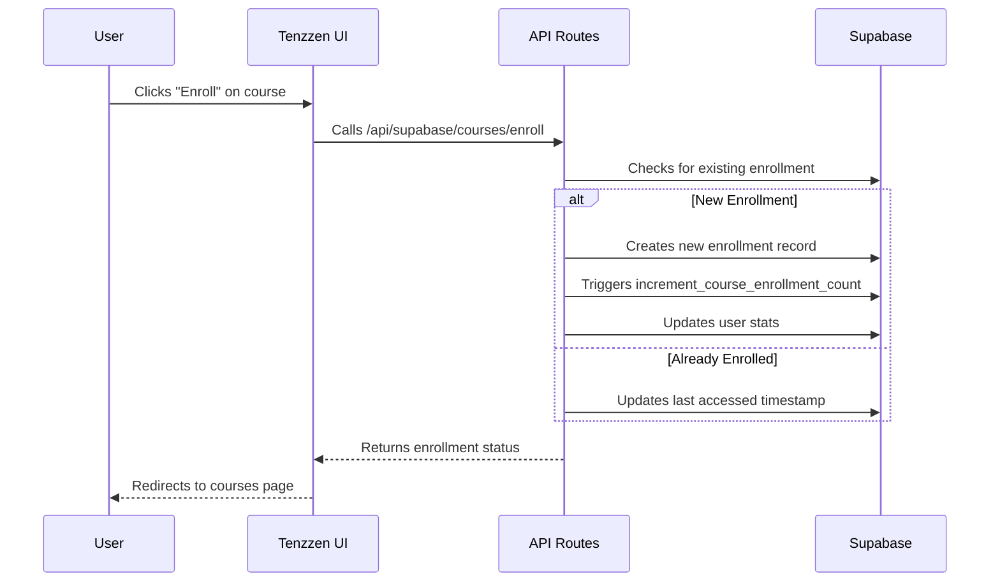
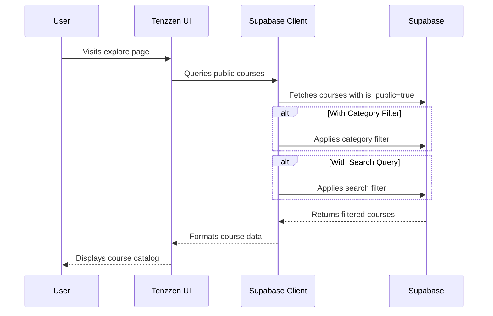
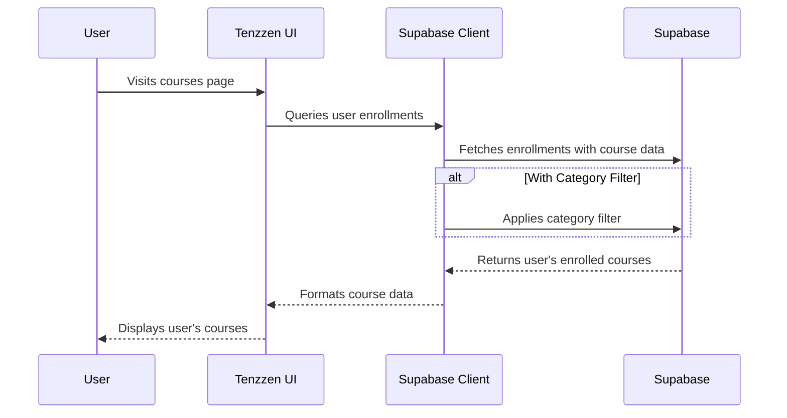
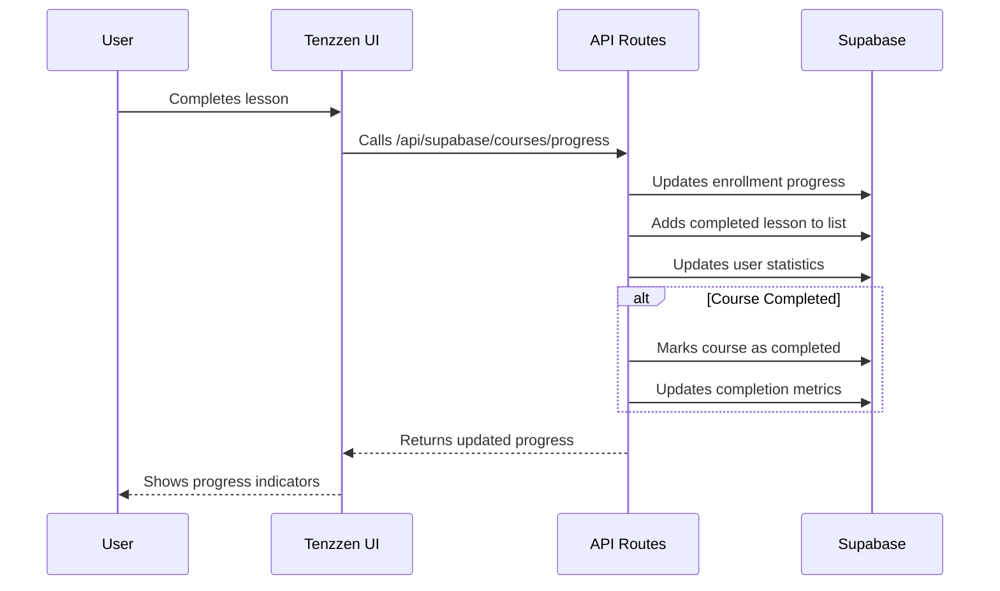

# Tenzzen Database Structure and User Flows

This document provides a comprehensive overview of the database architecture and user interaction flows for the Tenzzen learning platform.

## Database Schema Diagram

```mermaid
Diagram
    USERS ||--o{ USER_STATS : has
    USERS ||--o{ COURSES : creates
    USERS ||--o{ ENROLLMENTS : enrolls_in

    COURSES ||--o{ ENROLLMENTS : has

    USERS {
        uuid id PK
        text clerk_id
        text email
        text name
        text image_url
        text auth_provider
        text role
        text status
        timestamp created_at
        timestamp updated_at
    }

    USER_STATS {
        uuid id PK
        uuid user_id FK
        integer courses_completed
        integer courses_in_progress
        integer total_learning_time
        jsonb achievements
        timestamp created_at
        timestamp updated_at
    }

    COURSES {
        uuid id PK
        text title
        text subtitle
        text description
        text video_id
        text youtube_url
        text thumbnail
        boolean is_public
        uuid created_by FK
        text creator_id
        float avg_rating
        integer enrollment_count
        text status
        text difficulty_level
        interval estimated_duration
        float estimated_hours
        timestamp created_at
        timestamp updated_at
        text[] tags
        text category
        boolean featured
        float popularity
        jsonb metadata
        text generated_summary
        text transcript
        jsonb course_items
    }

    ENROLLMENTS {
        uuid id PK
        uuid user_id FK
        uuid course_id FK
        timestamp enrolled_at
        timestamp last_accessed_at
        text completion_status
        float progress
        boolean is_active
        text[] completed_lessons
        text last_lesson_id
        float total_time_spent
        text notes
        boolean reminder_enabled
        text reminder_frequency
        jsonb learning_goal
    }
```

## Core Entity Relationships

### Content Organization

- **Courses** are structured learning experiences built from YouTube videos with additional structure (sections, lessons) stored in the `course_items` JSONB field.
- **Categories** (as a text field) and **Tags** (as a text array) provide classification and searchability for courses.
- **Transcripts** are stored directly in the courses table for content analysis and searchability.

### User Management

- **Users** contain core identity information linked with Clerk authentication.
- **User Stats** track overall learning metrics for dashboards.

### User Learning Journey

- **Enrollments** track a user's progress through a course, including completed lessons and total time spent.
- **Course Items** (stored in the courses table as JSONB) define the structure of the course with sections and lessons.

### User Experience & Engagement

- **Public Courses** are available to all users in the explore page.
- **User Enrollments** are private to each user and displayed on their courses page.
- **Course Progress** is tracked individually for each user through their enrollment record.

## User Flow Diagrams

### 1. Course Generation Flow



### 2. Course Enrollment Flow



### 3. Explore Courses Flow



### 4. User Courses Flow



### 5. Learning Progress Flow



## Implementation Notes

### Data Consistency Strategy

- **Enrollment Progress Calculation**: Real-time updates based on completed lessons vs. total lessons.
- **User Stats Aggregation**: Updated when users complete courses or make significant progress.
- **Course Enrollment Count**: Maintained automatically through database triggers when users enroll in courses.

### Performance Considerations

- **Strategic Indexes**: Indexes on frequently queried fields (video_id, category, created_at, popularity).
- **Full-text Search**: Text search index on course titles for efficient searching.
- **Denormalization**: Course tags stored as arrays for read performance.
- **JSONB for Flexibility**: Course structure stored in JSONB for flexibility while maintaining query capabilities.

### Security & Privacy

- **Row Level Security (RLS)**: Enforces access control at the database level:
  - Public courses are visible to everyone
  - User enrollments are only visible to the enrolled user
  - Users can only update their own courses and enrollments
- **Service Role Access**: Administrative functions use the service role for necessary operations.
- **User Authentication**: Integration with Clerk for secure authentication.

## Database Functions and Triggers

- **User Identification**:

  - `get_user_id_from_clerk_id(clerk_id TEXT)`: Converts Clerk ID to Supabase user UUID
  - `get_user_id_from_auth_id()`: Gets current user's UUID from auth context

- **Enrollment Management**:
  - `increment_course_enrollment_count(course_id UUID)`: Increments course enrollment count
  - `decrement_course_enrollment_count(course_id UUID)`: Decrements course enrollment count
  - `update_course_enrollment_count()`: Trigger function for automatic enrollment count updates

## Type System

The database implements a consistent type system for data handling:

- **CourseStatus**: "draft" | "published" | "archived" | "generating" | "failed"
- **CompletionStatus**: "not_started" | "in_progress" | "completed"
- **DifficultyLevel**: "beginner" | "intermediate" | "advanced" | "expert"

## Future Enhancements

As the platform grows, these enhancements are planned:

1. **Normalized Course Structure**:

   - Create dedicated tables for course sections and lessons
   - This would allow for more efficient querying and updating of specific lessons

2. **Dedicated Categories and Tags Tables**:

   - Create separate tables for categories and tags
   - Implement many-to-many relationships for better organization

3. **Course Ratings System**:

   - Add a dedicated table for course ratings and reviews
   - Implement triggers to maintain the `avg_rating` field in the courses table

4. **Enhanced Analytics**:
   - Add more detailed tracking of user learning activities
   - Implement advanced analytics dashboards

This database structure supports all current Tenzzen features while enabling future expansion into advanced learning analytics, social learning features, and content marketplace capabilities.
