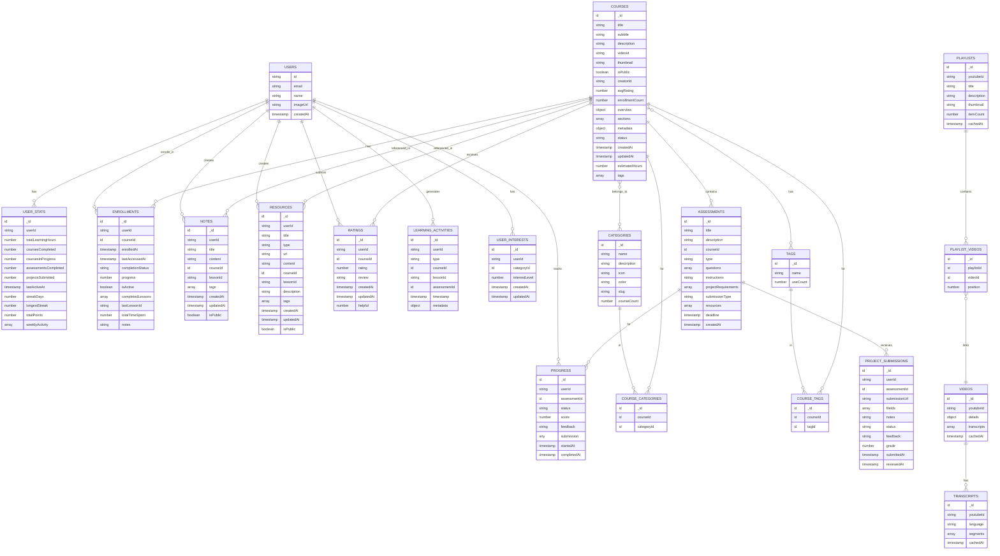
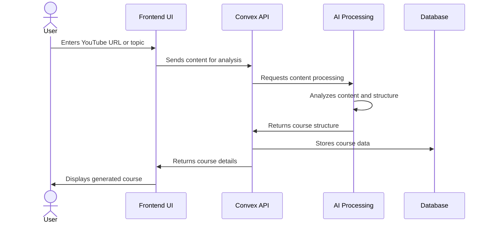
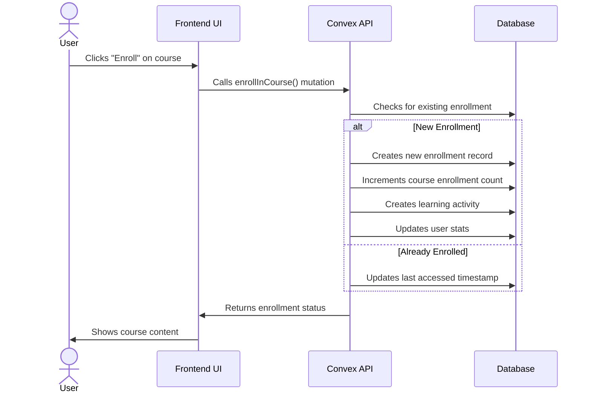
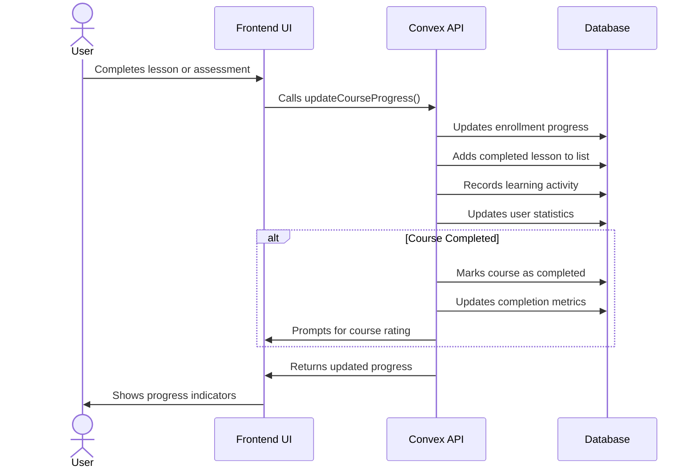
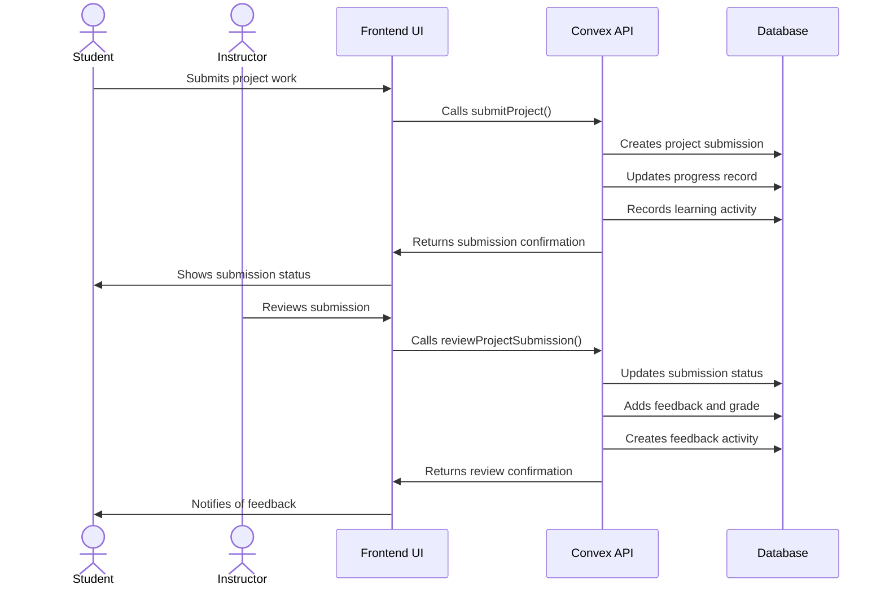
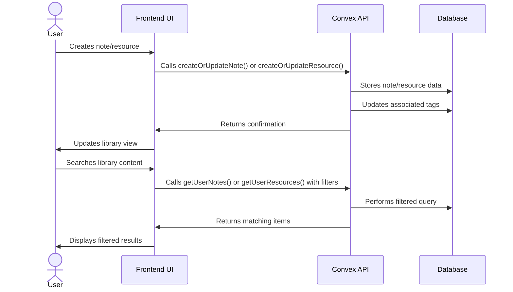
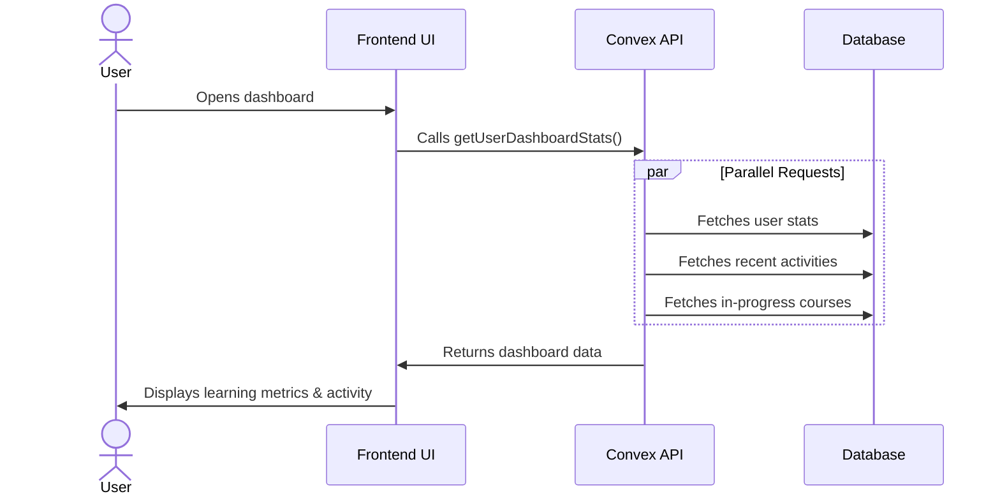

# Tenzzen Database Structure and User Flows

This document provides an overview of the Tenzzen learning platform's database structure, entity relationships, and key user flows.

## Database Schema Diagram

## Key Data Relationships

### Core Learning Experience

- **Users & Courses**: Users enroll in courses, which creates an enrollment record to track progress and completion status.
- **Courses & Assessments**: Courses contain assessments (quizzes and projects) to evaluate learning progress.
- **Assessments & Progress**: User progress is tracked for each assessment, recording scores and submission data.
- **Learning Activities**: All user actions generate learning activities, which are used for analytics and personalization.

### Content Organization

- **Courses & Categories**: Courses belong to multiple categories for organization and discovery.
- **Courses & Tags**: Courses have multiple tags for enhanced searchability.
- **Videos & Transcripts**: Videos store transcripts for content analysis and searchability.
- **Playlists & Videos**: Playlists organize videos in a sequence.

### User Generated Content

- **Users & Notes**: Users create notes related to courses and lessons.
- **Users & Resources**: Users create or save resources for learning.
- **Users & Ratings**: Users rate and review courses.

### Learning Metrics

- **User Stats**: Aggregate metrics about a user's learning activity.
- **Enrollments**: Track course progress and completion data.
- **Progress**: Track assessment completion and scores.

## Key User Flows

### Course Generation Flow

### Course Enrollment Flow

### Learning Progress Flow

### Project Submission Flow

### Notes & Resources Flow

### Dashboard Analytics Flow

## Database Indexing Strategy

The database schema includes strategic indexes to optimize common query patterns:

1. **User-Based Queries**

   - All tables with `userId` have indexes for quick retrieval of user-specific data
   - Compound indexes for user + entity combinations (e.g., user-course, user-assessment)

2. **Course Discovery**

   - Indexes on `isPublic` for exploring available courses
   - Compound indexes for filtering by category and tags
   - Full-text search indexes on course titles and descriptions

3. **Content Relationships**

   - Indexes on all relationship tables (course_categories, course_tags)
   - Indexes on foreign keys for quick joins

4. **Time-Based Queries**
   - Indexes on timestamp fields for chronological sorting
   - Compound indexes for time-ranged user activities

## Data Flow Architecture

The Tenzzen platform follows a well-structured data flow pattern:

1. **Content Ingestion**

   - YouTube content is processed and stored in the videos and transcripts tables
   - AI analysis transforms raw content into structured course data

2. **User Engagement**

   - User interactions are captured as enrollments and learning activities
   - Progress is tracked at multiple levels (course, lesson, assessment)

3. **Content Generation**

   - Users create notes and resources linked to courses and lessons
   - User feedback generates ratings and reviews

4. **Analytics & Personalization**
   - User actions aggregate into statistics and trends
   - Personalized recommendations are generated based on interests and history

This architecture ensures efficient data storage, retrieval, and analysis while supporting the platform's core learning features and personalization capabilities.
