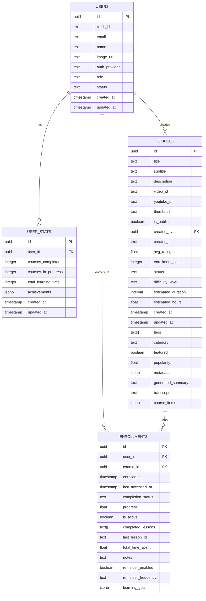
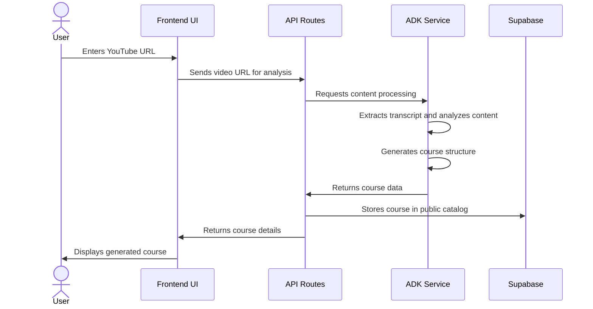
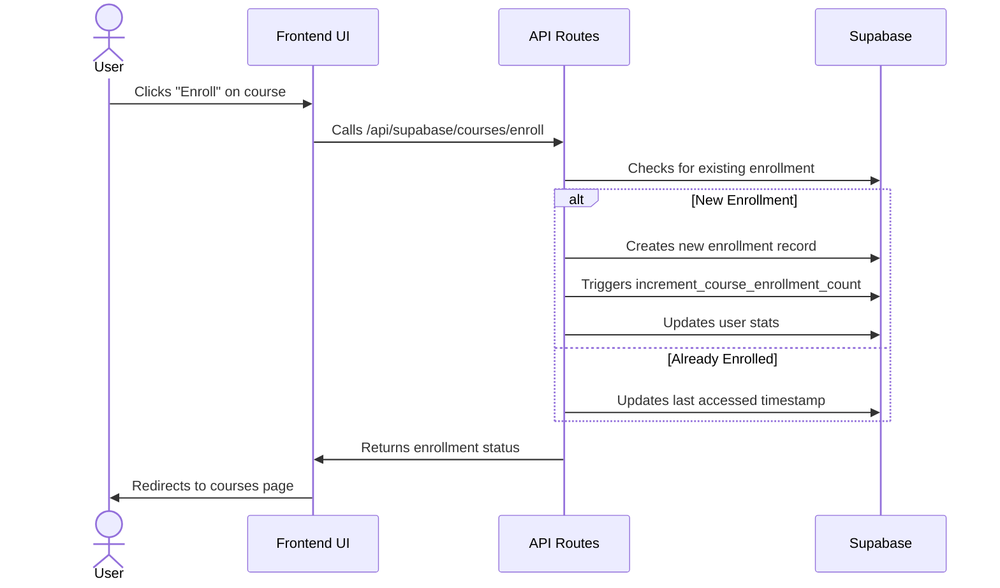
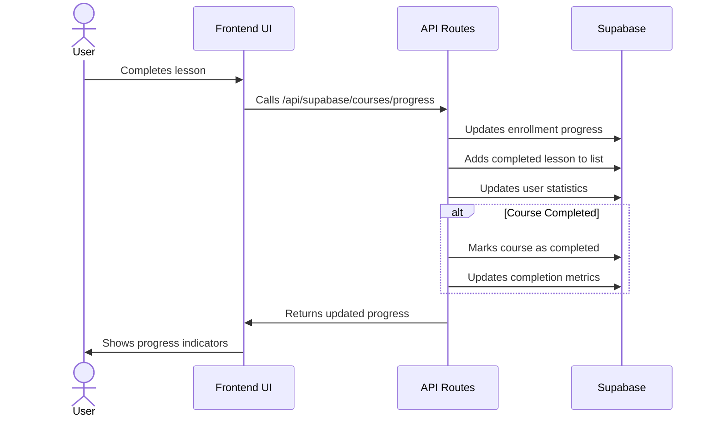
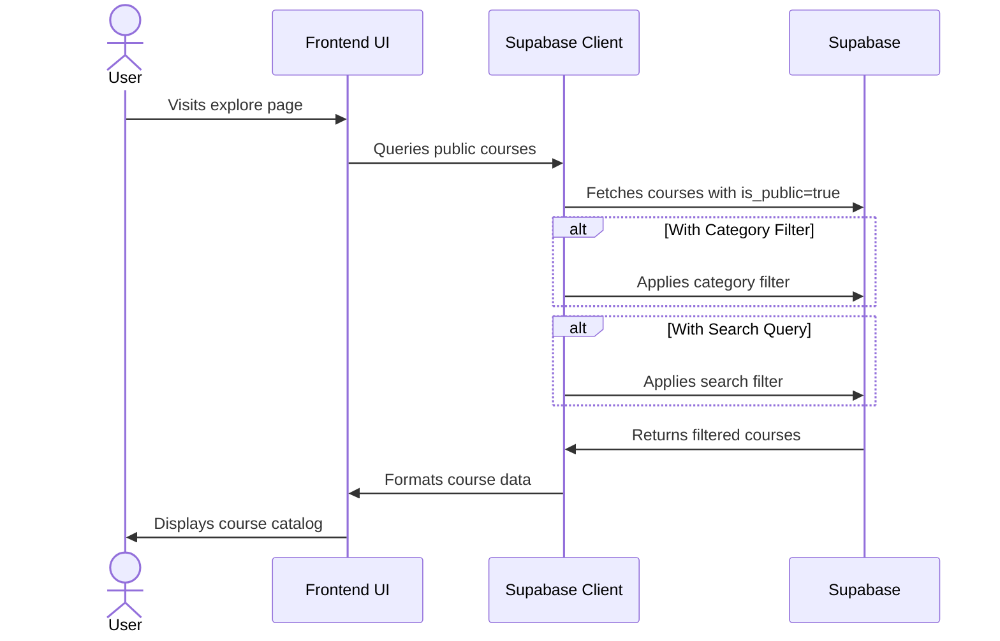
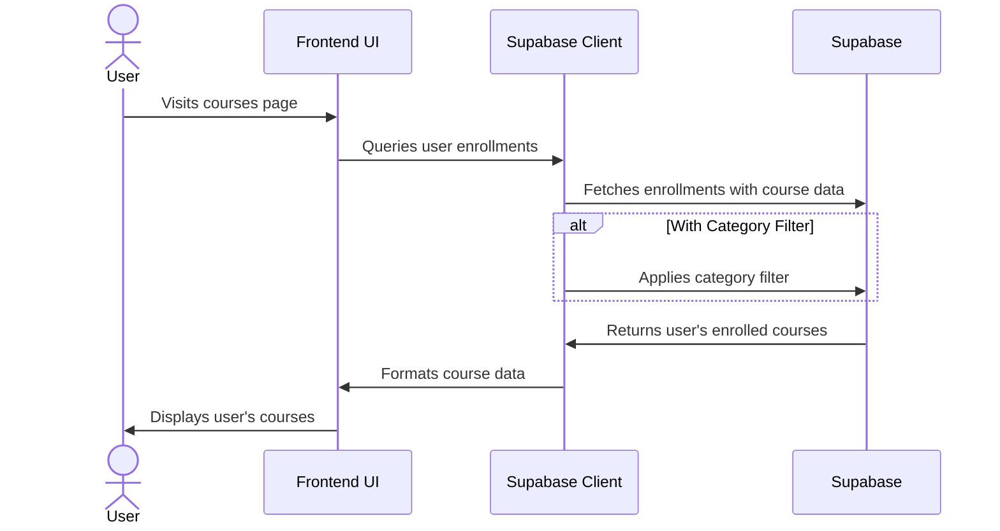

# Tenzzen Database Architecture

This document provides a comprehensive overview of the Tenzzen learning platform's database structure, entity relationships, and key user flows.

## Database Schema Diagram

## Key Data Relationships

### Core Learning Experience

- **Users & Courses**: Users create courses from YouTube videos, which are stored in the public catalog.
- **Users & Enrollments**: Users enroll in courses, creating an enrollment record to track progress and completion status.
- **Courses & Course Items**: Course structure (sections and lessons) is stored in the `course_items` JSONB field for flexibility.
- **Enrollments & Progress**: User progress is tracked through the enrollments table, recording completed lessons and overall progress.

### Content Organization

- **Courses & Categories**: Courses have a primary category for organization and discovery.
- **Courses & Tags**: Courses have multiple tags (stored as an array) for enhanced searchability.
- **Courses & Transcripts**: Course transcripts are stored directly in the courses table for content analysis and searchability.

### User Experience & Engagement

- **User Stats**: Aggregate metrics about a user's learning activity, including courses completed and total learning time.
- **Course Visibility**: Courses are public by default, allowing all users to discover and enroll in them.
- **Course Enrollment**: Users can enroll in any public course, creating a private enrollment record to track their progress.

## Key User Flows

### Course Generation Flow

### Course Enrollment Flow

### Learning Progress Flow

### Explore Courses Flow

### User Courses Flow

## Database Indexing Strategy

The database schema includes strategic indexes to optimize common query patterns:

1. **User-Based Queries**
   - Index on `enrollments.user_id` for quick retrieval of user-specific enrollments
   - Index on `courses.created_by` for finding courses created by a specific user

2. **Course Discovery**
   - Index on `courses.is_public` for exploring available courses
   - Index on `courses.category` for filtering by category
   - Full-text search index on course titles using `to_tsvector` for enhanced search performance
   - Index on `courses.video_id` for quick lookups when checking for existing courses

3. **Time-Based Queries**
   - Index on `courses.created_at` for chronological sorting
   - Index on `enrollments.last_accessed_at` for sorting by recent activity

4. **Performance Optimization**
   - Index on `courses.popularity` for sorting trending courses
   - Compound indexes for common filter combinations

## Row Level Security (RLS)

Tenzzen implements Row Level Security to ensure data privacy and access control:

1. **Courses Table Policies**
   - "Public courses are viewable by everyone" - Allows anyone to view courses with `is_public = true`
   - "Users can view their enrolled courses" - Users can view courses they're enrolled in, even if not public
   - "Users can create courses" - Authenticated users can create new courses
   - "Users can update their own courses" - Users can only update courses they created
   - "Users can delete their own courses" - Users can only delete courses they created

2. **Enrollments Table Policies**
   - "Users can view their own enrollments" - Users can only view their own enrollment records
   - "Users can insert their own enrollments" - Users can only create enrollments for themselves
   - "Users can update their own enrollments" - Users can only update their own enrollment records
   - "Users can delete their own enrollments" - Users can only delete their own enrollment records

## Database Functions and Triggers

The database includes several functions and triggers to maintain data consistency:

1. **User Identification**
   - `get_user_id_from_clerk_id(clerk_id TEXT)` - Converts a Clerk ID to a Supabase user UUID
   - `get_user_id_from_auth_id()` - Gets the current user's UUID from their auth context

2. **Enrollment Management**
   - `increment_course_enrollment_count(course_id UUID)` - Increments a course's enrollment count
   - `decrement_course_enrollment_count(course_id UUID)` - Decrements a course's enrollment count
   - `update_course_enrollment_count()` - Trigger function that automatically updates enrollment counts

## Type System

The database implements a consistent type system for data handling:

- **CourseStatus**: "draft" | "published" | "archived" | "generating" | "failed"
- **CompletionStatus**: "not_started" | "in_progress" | "completed"
- **DifficultyLevel**: "beginner" | "intermediate" | "advanced" | "expert"

## Future Enhancements

As the platform grows, consider these potential enhancements:

1. **Normalized Course Structure**
   - Create dedicated tables for course sections and lessons
   - This would allow for more efficient querying and updating of specific lessons

2. **Dedicated Categories and Tags Tables**
   - Create separate tables for categories and tags
   - Implement many-to-many relationships for better organization

3. **Course Ratings System**
   - Add a dedicated table for course ratings and reviews
   - Implement triggers to maintain the `avg_rating` field in the courses table

4. **Enhanced Analytics**
   - Add more detailed tracking of user learning activities
   - Implement advanced analytics dashboards
