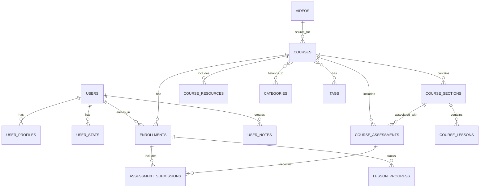

# Tenzzen Database Improvements

This document outlines the comprehensive database improvements implemented for the Tenzzen learning platform to create a fully normalized, industry-standard database structure. These improvements have been fully implemented and are now active in the application.

## Overview

The database improvements focus on:

1. Creating a fully normalized structure with proper relationships
2. Implementing industry-standard patterns used by established learning platforms
3. Ensuring data integrity through foreign key constraints and cascade operations
4. Optimizing performance with strategic indexes
5. Maintaining clear separation between public and private data

## Key Improvements

### 1. Normalized Course Structure

The course structure has been normalized into separate tables:

- **courses**: Core course information
- **course_sections**: Major divisions within a course
- **course_lessons**: Individual learning units within sections

This approach provides several benefits:
- More efficient querying and updating of specific components
- Better data integrity through proper relationships
- Improved performance for common operations

### 2. Video Data Separation

Video metadata is now stored in a dedicated table:

- **videos**: YouTube video metadata and transcripts

This separation allows:
- Multiple courses to reference the same video
- More efficient storage of video metadata
- Better organization of content sources

### 3. Categories and Tags

Categories and tags are now stored in dedicated tables with junction tables:

- **categories**: Course categories
- **tags**: Course tags
- **course_categories**: Junction table linking courses to categories
- **course_tags**: Junction table linking courses to tags

Benefits include:
- Efficient filtering and searching
- Consistent categorization across the platform
- Automatic counting of courses per category/tag

### 4. User Learning Progress

User learning progress is now tracked in detail:

- **enrollments**: User enrollment in courses
- **lesson_progress**: Detailed tracking of progress through individual lessons

This provides:
- Granular progress tracking
- Better resume functionality
- More accurate learning analytics

### 5. Additional Learning Features

New tables support advanced learning features:

- **user_notes**: Personal notes taken during learning
- **course_resources**: Additional learning materials
- **course_assessments**: Quizzes and projects
- **assessment_submissions**: User responses to assessments

### 6. Database Functions and Triggers

Automatic data management through functions and triggers:

- **Enrollment Count Management**: Automatically update course enrollment counts
- **User Stats Updates**: Keep user statistics current based on learning activity
- **Category and Tag Management**: Maintain counts and relationships

## Implementation Details

### Database Structure SQL

The database structure improvements are implemented in two SQL files:

1. `public/db-structure-improvements.sql`: Creates new tables and enhances existing ones
2. `public/db-data-migration.sql`: Migrates data from the existing structure to the new normalized tables

### API Endpoints

The following API endpoints have been created and are now active:

1. `app/api/supabase/setup/db-improvements/route.ts`: Applies the database structure improvements
2. `app/api/supabase/setup/db-migration/route.ts`: Applies the data migration
3. `app/api/supabase/courses/save/route.ts`: Updated to use the normalized structure while maintaining backward compatibility
4. `app/api/supabase/courses/save-normalized/route.ts`: Alternative endpoint that exclusively uses the normalized structure

### Admin Interface

An admin interface has been created to apply the database improvements:

- `app/admin/database/page.tsx`: UI for applying database improvements and migrations

## Database Schema

## Data Flow Examples

### Course Generation Flow

1. User submits YouTube URL
2. System fetches video metadata and transcript
3. Video data is saved to the `videos` table
4. Course data is saved to the `courses` table
5. Course sections and lessons are saved to their respective tables
6. Categories and tags are processed and linked to the course
7. Course is available in the public catalog

### Enrollment Flow

1. User discovers course in public catalog
2. User clicks "Enroll" button
3. System creates enrollment record in `enrollments` table
4. System creates initial lesson progress records in `lesson_progress` table
5. System increments course enrollment count
6. User is redirected to their courses page

### Learning Progress Flow

1. User accesses enrolled course
2. User watches lesson videos
3. System tracks progress in `lesson_progress` table
4. System updates enrollment progress percentage
5. When all lessons are completed, course is marked as completed

## Performance Considerations

The normalized structure includes several performance optimizations:

1. **Strategic Indexes**: Indexes on frequently queried fields
2. **Efficient Joins**: Properly designed relationships for efficient joins
3. **Pagination Support**: Structure supports efficient pagination for course listings
4. **Caching Friendly**: Clear separation of rarely changing data (course structure) from frequently changing data (user progress)

## Security Model

The database structure enforces a clear security model:

1. **Public vs. Private Data**:
   - Courses, videos, categories, and tags are public
   - Enrollments, progress, notes, and submissions are private to each user

2. **Row Level Security (RLS)**:
   - Public data is readable by everyone
   - Private data is only accessible to the owning user
   - Service role access for administrative functions

## Migration Path

The migration path has been implemented and is non-destructive:

1. ✅ Apply database structure improvements - Implemented via admin interface
2. ✅ Migrate existing data to the new structure - Implemented via data migration scripts
3. ✅ Update application code to use the new structure - Course save endpoint updated
4. ✅ Maintain backward compatibility - Legacy fields preserved for compatibility

The migration is complete, with all components now using the normalized structure while maintaining backward compatibility with any existing code that might still expect the old structure.

## Conclusion

These database improvements create a robust, scalable foundation for the Tenzzen learning platform. The normalized structure follows industry standards used by established learning platforms like Udemy, Coursera, and Skillshare, while providing the flexibility needed for future enhancements.

The improvements address the specific requirements outlined in the project context:
- All generated courses are stored in a public catalog
- Users must explicitly enroll in courses to add them to their personal collection
- User-specific data is private and linked to enrollments
- The system prevents regeneration of already existing courses

This structure will support the learning journey described in the app context document while providing a solid foundation for future growth.
