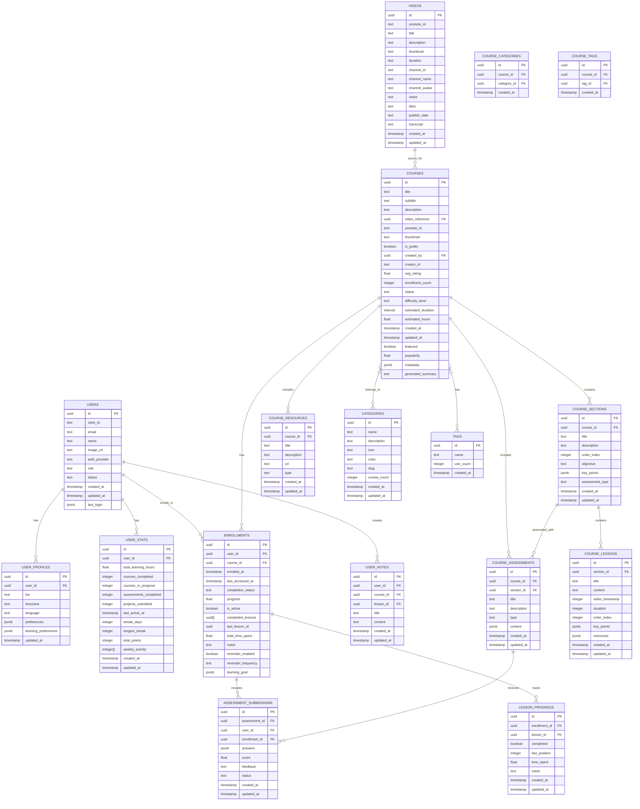

# Tenzzen Database Structure

This document provides a comprehensive overview of the Tenzzen learning platform's database structure, entity relationships, and key data flows. This structure has been fully implemented and is currently active in the application.

## Database Schema Diagram

## Core Entity Relationships

### Content Organization

- **Videos**: Store YouTube video metadata and transcripts
- **Courses**: Structured learning experiences built from videos
- **Course Sections**: Major divisions within a course
- **Course Lessons**: Individual learning units within sections
- **Categories & Tags**: Classification system for courses

### User Management

- **Users**: Core identity information linked with Clerk authentication
- **User Profiles**: Extended user information and preferences
- **User Stats**: Learning metrics and achievements

### Learning Journey

- **Enrollments**: Track user enrollment in courses
- **Lesson Progress**: Detailed tracking of user progress through lessons
- **Assessment Submissions**: User responses to quizzes and projects
- **User Notes**: Personal notes taken during learning

## Key Data Flows

### Course Generation Flow

1. User submits YouTube URL
2. System fetches video metadata and transcript
3. AI processes content to generate structured course
4. Course is saved to public catalog
5. User can enroll in the generated course

### Enrollment Flow

1. User discovers course in public catalog
2. User clicks "Enroll" button
3. System creates enrollment record
4. System increments course enrollment count
5. User is redirected to their courses page

### Learning Progress Flow

1. User accesses enrolled course
2. User completes lessons
3. System tracks progress in lesson_progress table
4. System updates enrollment progress percentage
5. When all lessons are completed, course is marked as completed

## Database Functions and Triggers

The following functions and triggers have been implemented to maintain data integrity:

- **Enrollment Management**:
  - `increment_course_enrollment_count`: Automatically increments the enrollment count when a user enrolls in a course
  - `decrement_course_enrollment_count`: Automatically decrements the enrollment count when a user unenrolls from a course
  - `manage_course_enrollment_count`: Trigger function that calls the appropriate function based on the operation (INSERT/DELETE)

- **User Stats Updates**:
  - `update_user_stats_on_enrollment_change`: Keeps user statistics current based on enrollment activity
  - Tracks courses in progress, completed courses, and total learning time

- **Course Structure Management**:
  - Normalized course structure with sections and lessons in separate tables
  - Maintains backward compatibility with the legacy JSONB structure

## Security Model

- **Row Level Security (RLS)**: Enforces access control at the database level
- **Public vs. Private Data**: Clear separation between public catalog and user-specific data
- **Service Role Access**: Administrative functions use the service role for necessary operations

## Performance Considerations

- **Normalized Structure**: Efficient querying and updating of specific components
- **Strategic Indexes**: Optimized for common query patterns
- **Denormalization Where Appropriate**: Some redundancy for read performance

This database structure supports all current Tenzzen features while enabling future expansion into advanced learning analytics, social learning features, and content marketplace capabilities.
