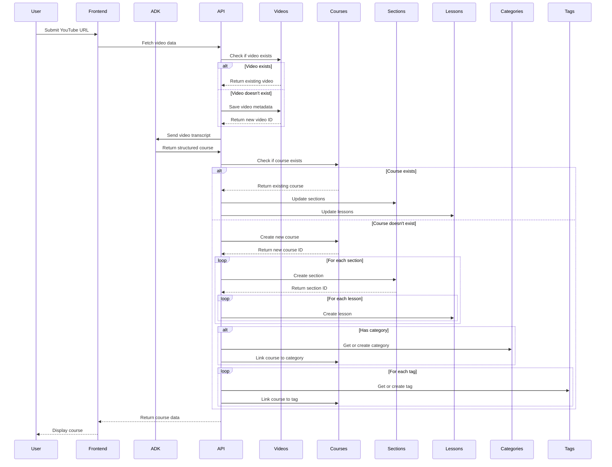
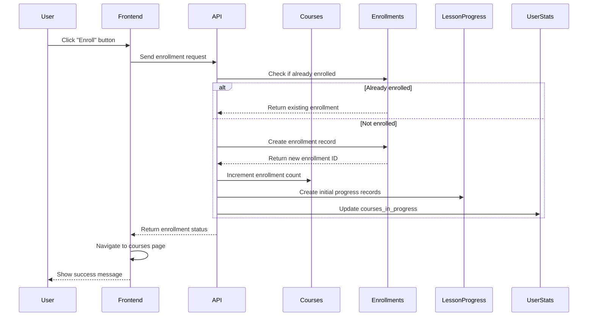
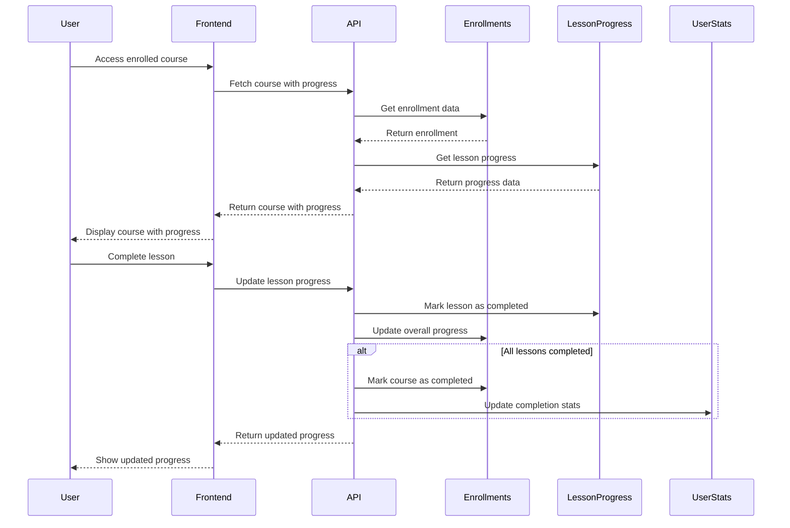
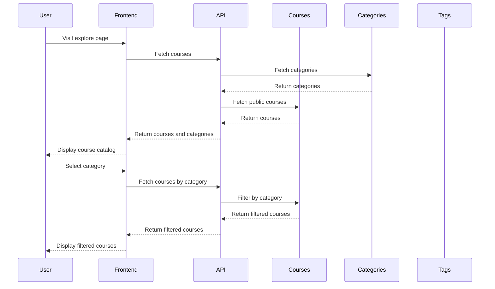
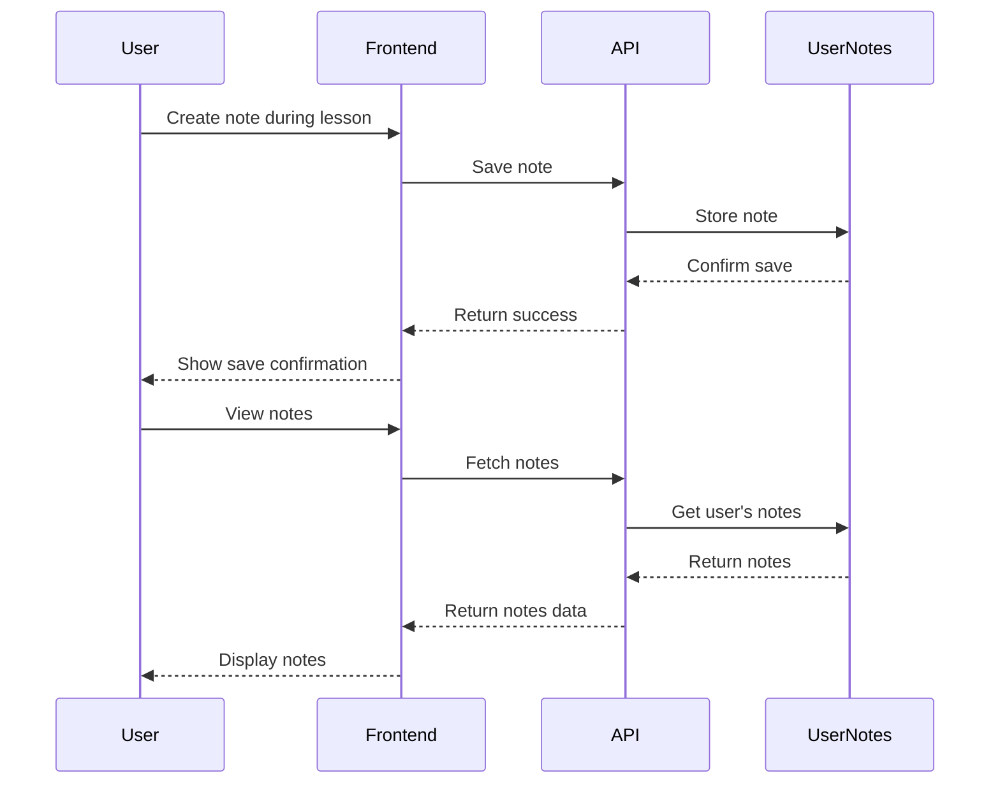
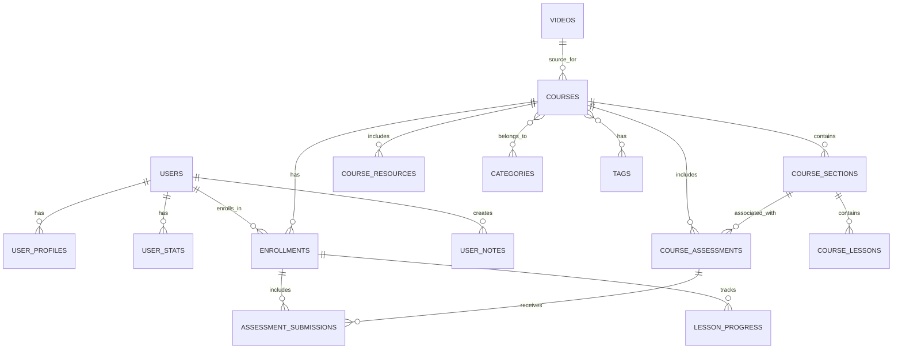

# Tenzzen Database Flow Diagram

This document provides visual representations of the key data flows in the Tenzzen learning platform. These flows have been fully implemented and are currently active in the application.

## Course Generation Flow

## Enrollment Flow

## Learning Progress Flow

## Course Discovery Flow

## User Notes Flow

## Database Entity Relationships

