# Tenzzen Database Relational Diagram

This document provides a visual representation of Tenzzen's complete database structure, including all tables, their relationships, and key fields.

## Database Overview

Tenzzen's database is a complex relational structure built on Convex that enables a comprehensive learning platform with course management, user progress tracking, assessments, and more. The diagram below illustrates how all components of the database interconnect.

## Complete Database Relational Diagram

```mermaid
erDiagram
    %% USER RELATED TABLES
    USERS {
        string id PK
        string clerkId
        string email
        string name
        string imageUrl
        enum authProvider "clerk|google|github|discord|apple"
        enum role "user|admin|moderator|instructor"
        enum status "active|suspended|deleted|pending"
        number createdAt
        number updatedAt
        object lastLogin
    }

    USER_PROFILES {
        string id PK
        string userId FK
        string bio
        string timezone
        string language
        object preferences
        object learningPreferences
        number updatedAt
    }

    USER_STATS {
        string id PK
        string userId FK
        number totalLearningHours
        number coursesCompleted
        number coursesInProgress
        number assessmentsCompleted
        number projectsSubmitted
        number lastActiveAt
        number streakDays
        number longestStreak
        number totalPoints
        array weeklyActivity
        array badges
        number level
        enum learningStyle "visual|auditory|reading_writing|kinesthetic|multimodal"
        array topCategories
    }

    USER_INTERESTS {
        string id PK
        string userId FK
        string categoryId FK
        number interestLevel
        number createdAt
        number updatedAt
        enum source "user_selected|inferred|quiz"
    }

    TASKS {
        string id PK
        string userId FK
        string title
        string date
        enum type "assignment|quiz|project|reminder|other"
        string dueTime
        string description
        boolean completed
        number createdAt
        number updatedAt
    }

    %% CONTENT RELATED TABLES
    VIDEOS {
        string id PK
        string youtubeId
        object details
        array transcripts
        string cachedAt
        any courseData
    }

    PLAYLISTS {
        string id PK
        string youtubeId
        string title
        string description
        string thumbnail
        number itemCount
        string cachedAt
    }

    PLAYLIST_VIDEOS {
        string id PK
        string playlistId FK
        string videoId FK
        number position
    }

    %% COURSE RELATED TABLES
    COURSES {
        string id PK
        string title
        string subtitle
        string description
        string videoId
        string thumbnail
        boolean isPublic
        string creatorId
        number avgRating
        number enrollmentCount
        object overview
        array sections
        object metadata
        enum status "draft|published|archived|pending|generating|failed|ready"
        number createdAt
        number updatedAt
        number estimatedHours
        array tags
        boolean featured
        number popularity
    }

    CATEGORIES {
        string id PK
        string name
        string description
        string icon
        string color
        string slug
        number courseCount
    }

    TAGS {
        string id PK
        string name
        number useCount
    }

    COURSE_TAGS {
        string id PK
        string courseId FK
        string tagId FK
    }

    COURSE_CATEGORIES {
        string id PK
        string courseId FK
        string categoryId FK
    }

    COURSE_GROUPS {
        string id PK
        string title
        string description
        string thumbnail
        string creatorId FK
        boolean isPublic
        number createdAt
        number updatedAt
        number courseCount
        array tags
        string slug
    }

    COURSE_GROUP_MEMBERS {
        string id PK
        string groupId FK
        string courseId FK
        number position
    }

    %% LEARNING RELATED TABLES
    ENROLLMENTS {
        string id PK
        string userId FK
        string courseId FK
        number enrolledAt
        number lastAccessedAt
        enum completionStatus "not_started|in_progress|completed"
        number progress
        boolean isActive
        array completedLessons
        string lastLessonId
        number totalTimeSpent
        string notes
        boolean reminderEnabled
        enum reminderFrequency "daily|weekly|biweekly|monthly"
        object learningGoal
    }

    RATINGS {
        string id PK
        string userId FK
        string courseId FK
        number rating
        string review
        number createdAt
        number updatedAt
        number helpful
        boolean reported
        boolean verified
    }

    ASSESSMENTS {
        string id PK
        string title
        string description
        string courseId FK
        enum type "quiz|project|assignment|exam"
        array questions
        string instructions
        array projectRequirements
        enum submissionType "file|link|text|code|mixed"
        array resources
        number deadline
        number createdAt
        enum difficulty "beginner|intermediate|advanced|expert"
        number estimatedTime
        number passingScore
        boolean allowRetries
        number maxRetries
    }

    PROGRESS {
        string id PK
        string userId FK
        string assessmentId FK
        enum status "not_started|in_progress|completed|graded"
        number score
        any feedback
        any submission
        number startedAt
        number completedAt
        number attemptNumber
        number timeSpent
    }

    PROJECT_SUBMISSIONS {
        string id PK
        string userId FK
        string assessmentId FK
        string submissionUrl
        array fileIds
        string notes
        enum status "submitted|reviewed|revisions_requested|approved"
        string feedback
        number grade
        number submittedAt
        number reviewedAt
        string reviewerNotes
        number revisionCount
    }

    NOTES {
        string id PK
        string userId FK
        string title
        string content
        string courseId FK
        string lessonId
        array tags
        number createdAt
        number updatedAt
        boolean isPublic
        string aiSummary
        array highlights
        boolean isFavorite
    }

    RESOURCES {
        string id PK
        string userId FK
        string title
        enum type "link|file|document|video|image|code|pdf"
        string url
        string content
        string courseId FK
        string lessonId
        string description
        array tags
        number createdAt
        number updatedAt
        boolean isPublic
        number views
        boolean isFavorite
        enum sourceType "user_created|ai_generated|course_provided"
    }

    %% ACTIVITY AND ACHIEVEMENT TABLES
    LEARNING_ACTIVITIES {
        string id PK
        string userId FK
        enum type "started_course|completed_lesson|started_assessment|completed_assessment|submitted_project|received_feedback|earned_achievement|earned_points|shared_note|created_course|completed_course"
        string courseId FK
        string lessonId
        string assessmentId FK
        number timestamp
        any metadata
        boolean visible
    }

    ACHIEVEMENTS {
        string id PK
        string userId FK
        enum type "streak|course_completion|assessment_mastery|first_project|learning_milestone|perfect_score|community_contribution"
        string title
        string description
        number awardedAt
        number points
        string icon
        number level
        any metadata
    }

    RECOMMENDATIONS {
        string id PK
        string userId FK
        string courseId FK
        number score
        string reason
        number createdAt
        boolean viewed
        boolean dismissed
    }

    %% SYSTEM TABLES
    MIGRATIONS_REGISTRY {
        string id PK
        string migrationId
        string name
        string description
        number version
        number appliedAt
        any result
        boolean rerun
    }

    %% RELATIONSHIPS
    USERS ||--o{ USER_PROFILES : has
    USERS ||--o{ USER_STATS : has
    USERS ||--o{ USER_INTERESTS : has
    USERS ||--o{ TASKS : has
    USERS ||--o{ ENROLLMENTS : has
    USERS ||--o{ RATINGS : creates
    USERS ||--o{ PROGRESS : has
    USERS ||--o{ PROJECT_SUBMISSIONS : submits
    USERS ||--o{ NOTES : creates
    USERS ||--o{ RESOURCES : creates
    USERS ||--o{ LEARNING_ACTIVITIES : generates
    USERS ||--o{ ACHIEVEMENTS : earns
    USERS ||--o{ RECOMMENDATIONS : receives
    USERS ||--o{ COURSE_GROUPS : creates

    VIDEOS ||--o{ PLAYLIST_VIDEOS : included_in
    PLAYLISTS ||--o{ PLAYLIST_VIDEOS : contains

    COURSES ||--o{ COURSE_TAGS : has
    TAGS ||--o{ COURSE_TAGS : applied_to
    COURSES ||--o{ COURSE_CATEGORIES : belongs_to
    CATEGORIES ||--o{ COURSE_CATEGORIES : contains
    COURSES ||--o{ COURSE_GROUP_MEMBERS : included_in
    COURSE_GROUPS ||--o{ COURSE_GROUP_MEMBERS : contains
    COURSES ||--o{ ENROLLMENTS : has
    COURSES ||--o{ RATINGS : receives
    COURSES ||--o{ ASSESSMENTS : contains
    COURSES ||--o{ NOTES : related_to
    COURSES ||--o{ RESOURCES : related_to
    COURSES ||--o{ RECOMMENDATIONS : recommended_as
    COURSES ||--o{ LEARNING_ACTIVITIES : related_to

    CATEGORIES ||--o{ USER_INTERESTS : interested_in

    ASSESSMENTS ||--o{ PROGRESS : tracked_in
    ASSESSMENTS ||--o{ PROJECT_SUBMISSIONS : has
    ASSESSMENTS ||--o{ LEARNING_ACTIVITIES : related_to

```

## Table Groups Overview

The database tables are organized into six logical groups:

### 1. User-related Tables

- `users`: Core identity information linked with Clerk authentication
- `user_profiles`: Extended user information and preferences
- `user_stats`: User statistics and metrics (learning hours, completion rates, etc.)
- `user_interests`: User's interests in specific categories (for recommendations)
- `tasks`: User's personal calendar/to-do items

### 2. Content-related Tables

- `videos`: YouTube video metadata and transcripts
- `playlists`: YouTube playlist information
- `playlist_videos`: Relates playlists to videos (many-to-many)

### 3. Course-related Tables

- `courses`: Main course content and structure
- `categories`: Course categories for organization
- `tags`: Keywords/tags for courses
- `course_tags`: Relates courses to tags (many-to-many)
- `course_categories`: Relates courses to categories (many-to-many)
- `course_groups`: Collections of related courses
- `course_group_members`: Relates course groups to member courses

### 4. Learning-related Tables

- `enrollments`: User enrollments in courses
- `ratings`: Course reviews and ratings
- `assessments`: Course quizzes, assignments, projects, etc.
- `progress`: Assessment completion tracking
- `project_submissions`: Project assessment submissions
- `notes`: User study notes
- `resources`: Learning materials and resources

### 5. Activity and Achievement Tables

- `learning_activities`: User learning activity tracking
- `achievements`: Gamification elements (badges, etc.)
- `recommendations`: Personalized course suggestions

### 6. System Tables

- `migrations_registry`: Database migration tracking

## Key Relationships

### One-to-Many Relationships

- One user can have many enrollments, notes, resources, achievements, etc.
- One course can have many enrollments, assessments, ratings, etc.
- One assessment can have many progress records and project submissions

### Many-to-Many Relationships

- Courses ↔ Tags (via `course_tags`)
- Courses ↔ Categories (via `course_categories`)
- Playlists ↔ Videos (via `playlist_videos`)
- Course Groups ↔ Courses (via `course_group_members`)

## Database Features

### Validation

- Extensive use of validators (e.g., `difficultyLevelValidator`, `userRoleValidator`)
- Enum-like fields using union types (e.g., `v.union(v.literal("beginner"), v.literal("intermediate"), ...)`)
- Type safety through TypeScript and Convex validation

### Indexing

- Strategic indexes on key fields to optimize common queries
- Compound indexes for complex filtering scenarios
- Search indexes for full-text search capabilities

### Timestamps

- Creation and update timestamps for most records
- Activity timestamps for tracking user engagement over time

## Database Usage Patterns

### Data Creation

- Courses can be generated from YouTube content or created manually
- User-generated content includes notes, resources, and ratings
- Learning activities are automatically recorded as users interact with the platform

### Data Retrieval

- User dashboard shows enrollments, progress, and recommendations
- Course discovery based on categories, tags, and search
- Learning progress tracked through enrollments and assessment progress

### Data Updates

- Course progress updated as users complete lessons and assessments
- User stats updated based on learning activities
- Recommendations updated based on user interests and behavior

## Considerations for Database Evolution

1. **Performance**: Monitor query performance as data volume grows
2. **Archiving**: Consider strategies for archiving older data
3. **Caching**: Implement caching for frequently accessed data
4. **Sharding**: Prepare for potential sharding if needed for scale
5. **Migrations**: Follow established migration patterns for schema changes
